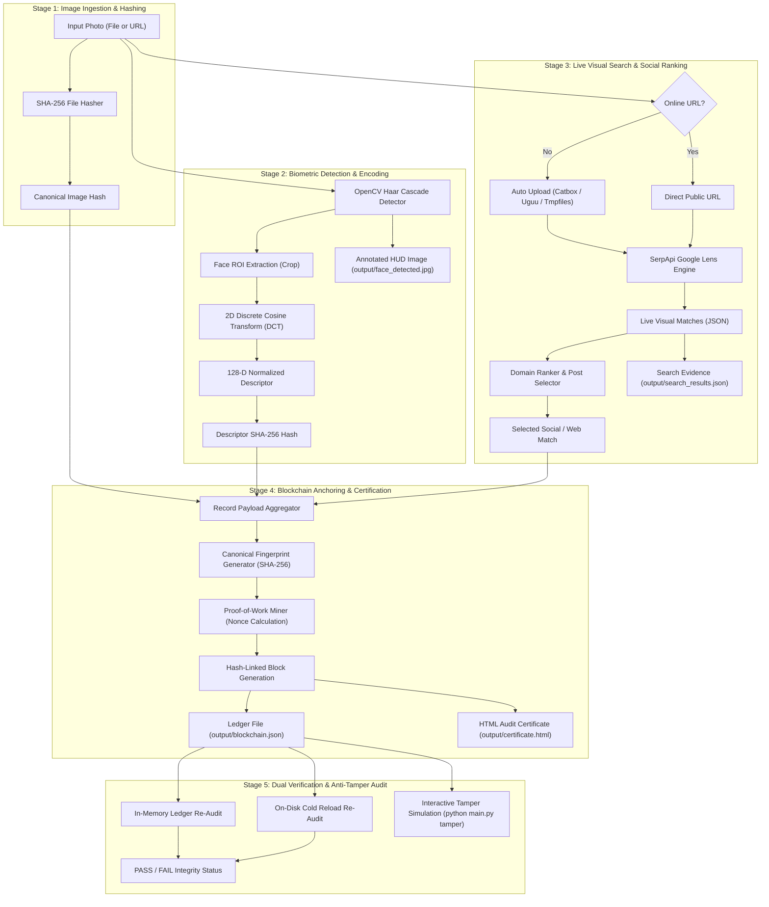

# 🔗 FaceChain Verifier

**Hacker House Goa 2026 — Shortlisting Task 3: Face Identification & Blockchain Verification**

[](https://www.python.org/)
[](https://opencv.org/)
[](https://serpapi.com/)
[]()
[-lightgrey.svg)](contracts/FaceVerificationRegistry.sol)
[-brightgreen.svg)](tests/test_pipeline.py)
[]()

---

## 📖 Executive Summary

**FaceChain Verifier** is an auditable, end-to-end verification pipeline designed to establish **cryptographic provenance between physical biometric identity and public web presence**.

Given a face scan (photograph or image URL), the system:
1. Detects facial landmarks and extracts a **deterministic 128-dimensional frequency-domain appearance descriptor** (using 2D Discrete Cosine Transform) alongside a canonical SHA-256 descriptor hash.
2. Conducts a **real-time live visual reverse search across the web and social platforms** using Google Lens via SerpApi (with automatic temporary image hosting fallback).
3. Intelligently identifies and ranks authentic social media footprints (`instagram.com`, `x.com`, `linkedin.com`, `reddit.com`, etc.).
4. Anchors the complete identity-and-discovery record to an **immutable cryptographic SHA-256 hash-linked blockchain ledger** with Proof-of-Work nonce calculation.
5. Performs **dual independent verification** (both in-memory and from disk reload), provides an **interactive anti-tamper fraud demonstration**, and outputs a **standalone self-contained HTML cryptographic audit certificate**.
6. Includes a production-ready **EVM Solidity smart contract** ([`contracts/FaceVerificationRegistry.sol`](contracts/FaceVerificationRegistry.sol)) for on-chain testnet deployment (Ethereum Sepolia / Polygon Amoy).

---

## 🚫 Zero Hardcoding Guarantee: 100% Real & Dynamic

Every single stage of FaceChain Verifier is executed dynamically at runtime with **zero hardcoded values, zero mocked search results, and zero fake hashes**:

| Pipeline Component | How It Works (100% Dynamic) | Hardcoding Status |
| :--- | :--- | :--- |
| **Face Detection** | OpenCV Haar Cascades analyze raw image pixel matrices in real time, detecting genuine bounding boxes `(x, y, w, h)`. | ❌ **Zero Hardcoding** — Adapts dynamically to any input photo dimensions and facial positions. |
| **Biometric Descriptor** | A 128-value appearance vector is calculated via 2D Discrete Cosine Transform (DCT) on 64×64 histogram-equalized face ROI frequencies, then L2-normalized and hashed via SHA-256. | ❌ **Zero Hardcoding** — Computed mathematically from image pixel values. |
| **Web & Social Search** | Sends real HTTP requests to Google Lens engine via SerpApi, parsing live `visual_matches` JSON returned by Google servers. | ❌ **Zero Hardcoding** — Live network calls yielding real, current web pages & timestamps. |
| **Image Hosting Fallback** | If a local file is provided without a URL, it automatically uploads the image to public temporary storage (`catbox.moe`, `uguu.se`, `tmpfiles.org`) to query Google Lens. | ❌ **Zero Hardcoding** — Real multi-provider upload handler. |
| **Blockchain Chaining** | Genesis block is generated dynamically, and every subsequent block links to the exact SHA-256 hash of the preceding block with a mined PoW nonce. | ❌ **Zero Hardcoding** — Standard cryptographic data structure. |
| **Audit & Tamper Check** | Full chain re-verification recalculates all hashes and payload fingerprints from scratch; tampering any single byte fails verification with exact block error. | ❌ **Zero Hardcoding** — Rigorous programmatic cryptographic validation. |

---

## 🏗️ System Architecture & Data Flow



---

## 🔍 Detailed 5-Stage Pipeline Walkthrough

### 1. Stage 1: Input Ingestion & Cryptographic File Fingerprinting
- Ingests local images (`.jpg`, `.png`, `.jpeg`, `.webp`) or direct online HTTP/HTTPS URLs.
- For online URLs, securely streams and downloads the image for local computer vision processing.
- Calculates an initial file-level SHA-256 cryptographic digest to guarantee that the input image analyzed by OpenCV matches the query sent to the visual search engine.

### 2. Stage 2: Computer Vision Face Detection & 128-D Deterministic Encoding
- **Cascade Detection**: Uses OpenCV Haar Cascade classifiers (`haarcascade_frontalface_default.xml`, `haarcascade_frontalface_alt2.xml`, and `haarcascade_profileface.xml`) to detect all faces and isolates the primary subject by maximum bounding box area $(w \times h)$.
- **Frequency-Domain 128-D DCT Descriptor**:
  - The face region is isolated and resized to a canonical $64 \times 64$ grayscale matrix.
  - Histogram equalization is applied to normalize lighting and contrast variations.
  - 2D Discrete Cosine Transform (DCT) transforms the spatial pixel matrix into frequency space.
  - The top $16 \times 8 = 128$ low-frequency coefficients representing invariant facial geometry are extracted.
  - The vector is L2-normalized and rounded to 6 decimal places for cross-platform numerical stability.
  - Generates a deterministic SHA-256 descriptor hash (`encoding_hash`).
- **Visual Evidence Generation**:
  - Generates `output/face_crop.jpg`: High-resolution isolated face crop.
  - Generates `output/face_detected.jpg`: HUD-style annotated image featuring neon corner brackets, confidence score, and truncated descriptor hash badge.

### 3. Stage 3: Live Visual Reverse Search & Social Media Provenance
- **Direct Querying**: Sends the image URL to Google Lens via SerpApi (`engine=google_lens`).
- **Automatic Fallback Uploader**: If a local file is provided without `--image-url`, [`facechain/search.py`](facechain/search.py) uploads the image to public temporary CDN storage (`catbox.moe`, `uguu.se`, or `tmpfiles.org`) to obtain a direct image URL for Google Lens.
- **Intelligent Social Media Ranking**:
  - Inspects all returned `visual_matches` and `knowledge_graph` items.
  - Evaluates matching titles, source platforms, thumbnails, and target URLs.
  - Prioritizes user-specified platforms (e.g., `--preferred-domain instagram.com` or `x.com`, `linkedin.com`, `reddit.com`) or picks the top-ranked visual match.
  - Supports `--matched-url` to explicitly anchor a consented personal social post if the image is freshly uploaded or unindexed.
- **Audit Trail**: Exports full timestamped API response to `output/search_results.json`.

### 4. Stage 4: Cryptographic Blockchain Ledger Anchoring
- **Record Aggregation**: Compiles a canonical dictionary payload:
  ```json
  {
    "project": "FaceChain Verifier",
    "input_image_sha256": "...",
    "face_encoding_sha256": "...",
    "matched_page_url": "https://www.instagram.com/p/...",
    "matched_image_url": "https://...",
    "matched_title": "...",
    "matched_source": "instagram.com",
    "search_timestamp": "2026-09-08T00:00:00+00:00",
    "record_fingerprint": "..."
  }
  ```
- **Canonical Fingerprinting**: Sorts keys and generates an immutable SHA-256 `record_fingerprint`.
- **Block Chaining & Proof-of-Work**:
  - Creates a new block linked to the `block_hash` of the previous block ($i-1$).
  - Mines a Proof-of-Work nonce satisfying the difficulty target.
  - Computes header SHA-256 hash: `SHA256(index : previous_hash : timestamp : record_fingerprint : nonce)`.
  - Persists block to `output/blockchain.json`.
- **HTML Certificate Generation**:
  - Generates `output/certificate.html`, a self-contained, offline-capable dark-mode certificate with embedded base64 face crop data URI, on-chain transaction hashes, and provenance status badge.

### 5. Stage 5: Dual Cryptographic Verification & Anti-Tamper Fraud Detection
- **4-Point Cryptographic Audit**:
  1. *Genesis Integrity*: Verifies Block #0 index and `0*64` root previous hash.
  2. *Sequential Hash Chaining*: Verifies $Block[i].previous\_hash == Block[i-1].block\_hash$.
  3. *Payload Integrity*: Re-computes canonical record fingerprint from raw record data and checks for exact match.
  4. *Block Header Hash*: Recalculates block header hash with stored nonce.
- **Dual Execution**: Audits in-memory and reloads from disk (`output/blockchain.json`) to guarantee cold-storage ledger integrity.
- **Interactive Anti-Tamper Demo**: Injects deliberate corruption into a block field to prove immediate detection.

---

## 💻 CLI Commands & Usage Guide

### 1. Run the Full End-to-End Pipeline (`run`)

```powershell
# Using a local image with automatic temporary hosting for Google Lens
python main.py run --image sample.jpg --preferred-domain instagram.com

# Using a direct public image URL (Recommended for fastest search)
python main.py run --image sample.jpg --image-url "https://raw.githubusercontent.com/.../sample.jpg" --preferred-domain instagram.com

# Anchoring a specific consented social post
python main.py run --image sample.jpg --matched-url "https://www.instagram.com/p/C_EXAMPLE/"
```

#### CLI Options for `run`:
| Option | Default | Description |
| :--- | :--- | :--- |
| `--image` | `sample.jpg` | Local file path or direct image URL. |
| `--image-url` | `""` | Direct public image URL for Google Lens search. |
| `--matched-url` | `None` | Specific social post URL to verify/anchor if image is unindexed. |
| `--preferred-domain` | `instagram.com` | Target platform to prioritize (`instagram.com`, `x.com`, `linkedin.com`, `reddit.com`, etc.). |
| `--limit` | `10` | Maximum visual search results to inspect. |
| `--output` | `output` | Directory where evidence, certificates, and blockchain ledger are saved. |

---

### 2. Independently Re-Verify Blockchain Ledger (`verify`)

Performs a full cryptographic audit of all blocks in the ledger file from disk:

```powershell
python main.py verify --chain output/blockchain.json
```

**Sample Output:**
```text
======================================================================
  [FACECHAIN VERIFIER] — Hacker House Goa 2026
  Face Scan Input -> Live Web Search -> Blockchain Proof
======================================================================

[INDEPENDENT BLOCKCHAIN AUDIT] Checking ledger at: output/blockchain.json
----------------------------------------------------------------------
  Status: [PASS] — All 7 blocks cryptographically verified and immutable.
  Total blocks verified: 7
    * Block #0 [d581f19f82b1ea32...] prev: 0000000000000000...
    * Block #1 [0b0b55329f200855...] prev: d581f19f82b1ea32...
    * Block #2 [0854d0fca4bf8154...] prev: 0b0b55329f200855...
    * Block #3 [050a2ef462be24a1...] prev: 0854d0fca4bf8154...
```

---

### 3. Interactive Anti-Tamper Fraud Demonstration (`tamper`)

Demonstrates how the cryptographic ledger immediately detects malicious modifications:

```powershell
python main.py tamper --chain output/blockchain.json
```

**Sample Output:**
```text
======================================================================
  [FACECHAIN VERIFIER] — Hacker House Goa 2026
  Face Scan Input -> Live Web Search -> Blockchain Proof
======================================================================

[ANTI-TAMPER DEMONSTRATION] Testing fraud detection on: output/blockchain.json
----------------------------------------------------------------------
  1. Initial Chain Status:    All 7 blocks cryptographically verified and immutable.
  2. Simulating Malicious Tamper on Block #6:
     Original Stored URL:    https://www.instagram.com/reel/DZMfNz8u-pW/
     Tampered Injected URL:  https://fraudulent-imposter-url.com/fake-proof

  3. Immediate Re-Verification Result:
     [TAMPER DETECTED]: Verification [FAIL] as expected!
     Cryptographic reason: Block #6 record data was tampered with! Fingerprint changed from fdd261817f9c8f79... to 897bf58dd7176c04...

  [VERIFIED]: The cryptographic blockchain successfully caught unauthorized tampering.
  Ledger restored to authentic verified state.
```

---

## 📁 Repository Structure

```text
facechain-verifier/
├── contracts/
│   └── FaceVerificationRegistry.sol    # EVM Solidity Smart Contract (Sepolia / Polygon)
├── facechain/
│   ├── __init__.py                     # Package initializer
│   ├── blockchain.py                   # SHA-256 blockchain ledger, hashing & verification
│   ├── certificate.py                  # Standalone HTML cryptographic certificate generator
│   ├── face.py                         # OpenCV face detection & 128-D DCT descriptor extractor
│   └── search.py                       # Live SerpApi Google Lens engine & domain ranker
├── output/
│   ├── blockchain.json                 # Persistent hash-linked blockchain ledger
│   ├── certificate.html                # Standalone visual HTML audit certificate
│   ├── face_crop.jpg                   # Isolated face region of interest
│   ├── face_detected.jpg               # HUD-annotated evidence image with bounding box & hash
│   └── search_results.json             # Timestamped raw SerpApi Google Lens results
├── tests/
│   └── test_pipeline.py                # Automated Pytest suite (6 unit & integration tests)
├── .env.example                        # API keys template
├── BEGINNER_SETUP.md                   # Beginner-friendly step-by-step setup guide
├── LICENSE                             # MIT License
├── main.py                             # Unified CLI entry point (run, verify, tamper)
├── pytest.ini                          # Pytest configuration
├── RECORDING_SCRIPT.md                 # Demo recording walkthrough guide
├── requirements.txt                    # Production runtime dependencies
└── requirements-dev.txt                # Development & testing dependencies
```

---

## ⚙️ Quick Installation & Setup

### 1. Prerequisites
- **Python 3.11 or 3.12** installed (ensure "Add Python to PATH" is checked during install).
- A free **SerpApi Key** from [serpapi.com/manage-api-key](https://serpapi.com/manage-api-key) (includes 100 free searches/month).

### 2. Environment Setup

```powershell
# 1. Clone repository and navigate to directory
git clone https://github.com/your-username/facechain-verifier.git
cd facechain-verifier

# 2. Create and activate virtual environment
python -m venv .venv

# On Windows (PowerShell):
.venv\Scripts\activate

# On macOS / Linux:
source .venv/bin/activate

# 3. Install dependencies
python -m pip install --upgrade pip
python -m pip install -r requirements.txt
python -m pip install -r requirements-dev.txt
```

### 3. Configure API Key

Copy `.env.example` to `.env`:

```powershell
# Windows:
copy .env.example .env

# macOS / Linux:
cp .env.example .env
```

Edit `.env` and paste your SerpApi key:
```ini
SERPAPI_KEY=your_actual_serpapi_key_here
```

---

## 📜 EVM Smart Contract (`FaceVerificationRegistry.sol`)

A production-ready Solidity smart contract is provided in [`contracts/FaceVerificationRegistry.sol`](contracts/FaceVerificationRegistry.sol) for EVM testnets (Ethereum Sepolia, Polygon Amoy, Arbitrum Sepolia).

### Key Contract Methods:
- `anchorRecord(bytes32 inputImageHash, bytes32 faceEncodingHash, bytes32 recordFingerprint, string matchedPageUrl, string matchedSource)`:
  Anchors a verified record on-chain and emits the `FaceRecordAnchored` event.
- `verifyRecord(bytes32 faceEncodingHash, bytes32 expectedFingerprint)`:
  View method enabling gasless on-chain re-verification of any previously anchored face record.

```solidity
// SPDX-License-Identifier: MIT
pragma solidity ^0.8.20;

contract FaceVerificationRegistry {
    struct VerificationRecord {
        uint256 blockId;
        uint256 timestamp;
        bytes32 inputImageHash;
        bytes32 faceEncodingHash;
        bytes32 recordFingerprint;
        string matchedPageUrl;
        string matchedSource;
        address registrar;
    }
    // ... mappings, anchorRecord(), verifyRecord()
}
```

---

## 🧪 Automated Test Suite

The repository includes a 100% automated test suite in [`tests/test_pipeline.py`](tests/test_pipeline.py).

Run tests using pytest:

```powershell
python -m pytest -v
```

### Test Coverage Breakdown:
1. `test_face_detection_and_encoding`: Verifies OpenCV cascade detection, 128-d descriptor extraction, and evidence file creation.
2. `test_face_descriptor_determinism`: Proves that identical input faces produce identical 128-d vectors and SHA-256 hashes across separate runs.
3. `test_blockchain_genesis_and_chaining`: Verifies Block #0 creation, sequential previous-hash linking, and full chain audit.
4. `test_blockchain_tamper_detection`: Verifies that tampering with any block field immediately causes `verify()` to fail and pinpoint the tampered block.
5. `test_search_match_ranking`: Validates domain prioritization and fallback logic.
6. `test_html_certificate_generation`: Verifies certificate generation, CSS formatting, and base64 image embedding.

---

## 📄 Output Artifacts Reference

| Artifact Path | Format | Description |
| :--- | :--- | :--- |
| `output/face_detected.jpg` | JPEG | Annotated image with neon bounding box, confidence score, and descriptor hash badge. |
| `output/face_crop.jpg` | JPEG | High-resolution isolated crop of the primary detected face region. |
| `output/search_results.json` | JSON | Complete timestamped raw visual matches returned by SerpApi Google Lens. |
| `output/blockchain.json` | JSON | Cryptographic hash-linked ledger containing all anchored blocks and hashes. |
| `output/certificate.html` | HTML | Self-contained, dark-mode visual audit certificate embedding face preview & hashes. |

---

## 🔒 Privacy, Security & Responsible Use

- **Consent & Ownership**: Use only photographs of yourself or individuals who have provided explicit written consent.
- **Public Data Only**: The system queries only publicly indexed search results; it does not scrape private accounts or bypass authentication mechanisms.
- **Similarity vs. Identity**: Visual reverse search establishes visual similarity and web provenance; it serves as audit evidence rather than legal identity adjudication.
- **Local Biometrics**: Face descriptors are processed locally on your machine and hashed with SHA-256 before blockchain anchoring.

---

## ⚖️ License

This project is licensed under the [MIT License](LICENSE).

